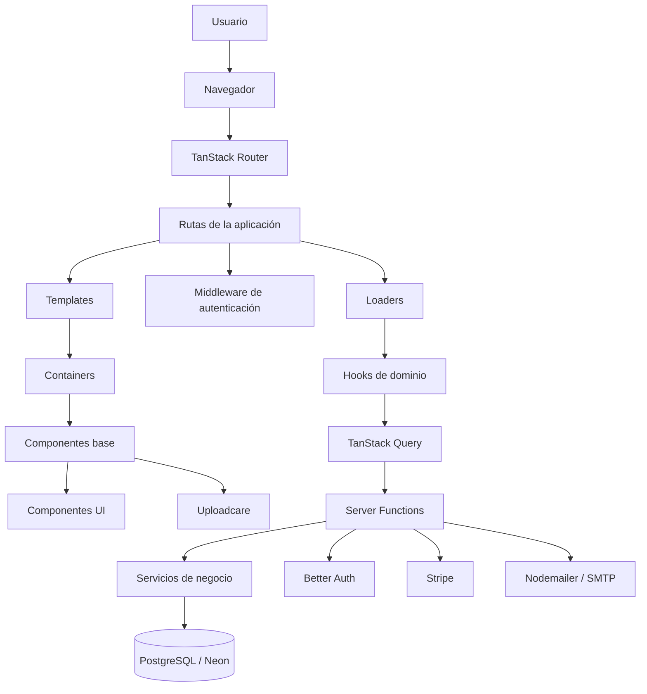
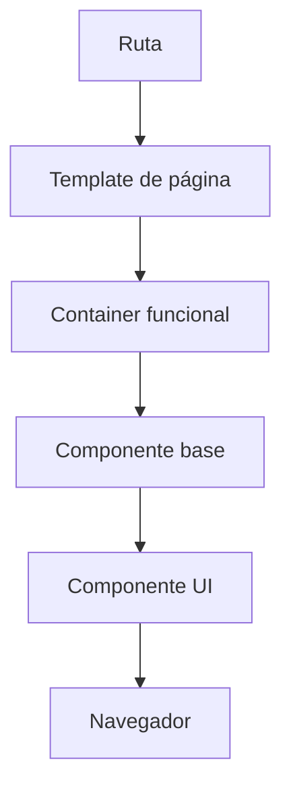
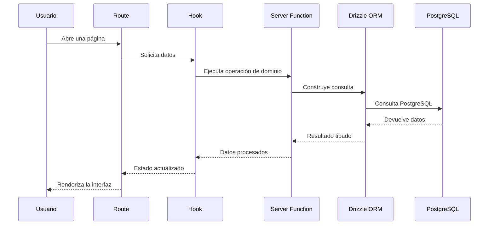
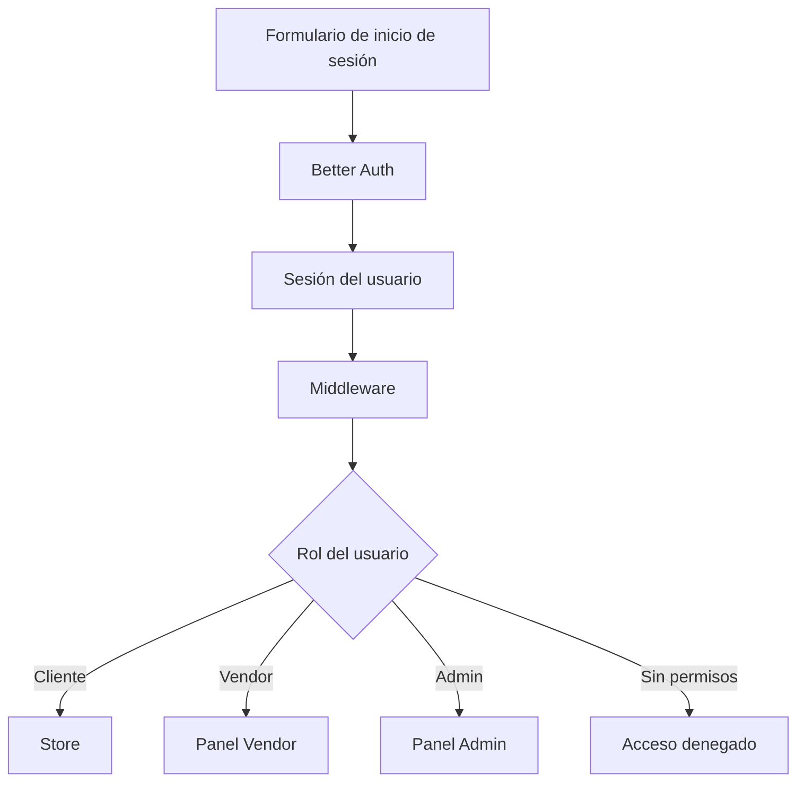

# Arquitectura

Arquitectura objetivo para la plataforma de delivery multi-restaurante, generada a partir
del `context-pack.md`, `codebase.md`, `architecture-agent.md` y la referencia del
TanStack Architecture Agent.

La migración ya iniciada incorpora TanStack Start, TanStack Router, TanStack Query y rutas
basadas en archivos. También existe la base server-only de Drizzle + PostgreSQL y Better Auth.
Las migraciones de base de datos, el esquema de auth y las credenciales reales todavía no se
han aplicado. El proyecto continúa en estado `new`.

## 1. Descripción general

La arquitectura objetivo es una aplicación de comercio electrónico multi-tenant para delivery
de comida, organizada por dominios y capas sobre React, TanStack Start, TanStack Router,
TypeScript, Drizzle ORM y PostgreSQL.

Los dominios principales son:

- **Store:** experiencia pública para clientes: restaurantes, menú, carrito, checkout, pedidos y reseñas.
- **Vendor:** panel de trabajo para restaurantes y sus operaciones.
- **Admin:** consola global para usuarios, restaurantes, pedidos, métricas y configuración.

Frontend y backend conviven en el mismo proyecto mediante TanStack Start y Server Functions.
La arquitectura de referencia se adopta como arquitectura objetivo; su migración desde el
starter actual requiere validación humana y work items específicos.

## 2. Arquitectura general



La dirección de dependencias prevista es descendente en la interfaz y de dominio hacia
persistencia en los datos. Las rutas coordinan; no contienen por sí solas la lógica visual,
de negocio ni de base de datos.

## 3. Estructura principal

```text
<proyecto>/
├── public/                  Archivos públicos
├── src/
│   ├── components/          Componentes visuales
│   ├── data/                Datos demo y seed
│   ├── hooks/               Hooks de React por dominio
│   ├── lib/                 Lógica compartida y backend
│   ├── routes/              Rutas de TanStack Router
│   ├── types/               Tipos TypeScript
│   ├── router.tsx           Configuración del router
│   ├── routeTree.gen.ts     Árbol generado de rutas
│   └── styles.css            Estilos globales
├── drizzle.config.ts        Configuración de Drizzle
├── server.ts                Servidor de producción alternativo
├── vite.config.ts            Configuración de Vite y Nitro
├── package.json              Dependencias y comandos
└── tsconfig.json             TypeScript y alias @/*
```

Esta es la estructura objetivo de la referencia. Ya están presentes `src/router.tsx`,
`src/routes/__root.tsx`, `src/routes/index.tsx` y el árbol generado `src/routeTree.gen.ts`.
Los módulos de base de datos, Server Functions, dominios Vendor/Admin y layouts completos
siguen pendientes.

## 4. Capa de rutas

Ubicación objetivo: `src/routes/`. TanStack Router genera el árbol a partir de archivos y
carpetas.

```text
src/routes/
├── __root.tsx
├── auth/
├── (store)/
├── (vendor)/
├── (admin)/
└── api/
```

Las rutas son responsables de definir la URL, seleccionar el template, ejecutar loaders,
aplicar middleware, mostrar errores específicos y conectar parámetros de URL con la lógica
del dominio.

Los grupos entre paréntesis organizan carpetas sin aparecer en la URL. Los nombres que
empiezan con `$` representan parámetros dinámicos como `$productId`, `$orderId` o `$tenantId`.

## 5. Layouts y Outlet

Los archivos `_layout.tsx` definen estructuras compartidas para las rutas hijas:

```text
src/routes/(store)/_layout.tsx
src/routes/(vendor)/_layout.tsx
src/routes/(admin)/admin.tsx
```

Los layouts mantienen navbar, sidebar, footer, menús, proveedores de tema y estructuras de
dashboard. Las rutas hijas se muestran mediante `<Outlet />`.

- El layout Store contiene la navegación pública y el contexto de compra.
- El layout Vendor contiene las herramientas operativas del restaurante.
- El layout Admin contiene la navegación y controles globales.
- El layout Auth contiene las pantallas de acceso y recuperación.

## 6. Componentes

Ubicación: `src/components/`. La interfaz se organiza en cuatro niveles:

```text
src/components/
├── ui/
├── base/
├── containers/
└── templates/
```

### UI

`components/ui/` contiene componentes genéricos basados en Radix UI y Tailwind CSS:
`button`, `input`, `dialog`, `dropdown-menu`, `table`, `tabs`, `select`, `calendar`,
`sidebar`, `tooltip` y `alert-dialog`.

No conocen reglas de productos, pedidos, restaurantes ni usuarios.

### Base

`components/base/` contiene piezas reutilizables con contexto visual o de dominio limitado:

```text
base/common/
base/data-table/
base/forms/
base/products/
base/store/
base/vendors/
base/error/
base/skeleton/
base/provider/
```

### Containers

`components/containers/` contiene bloques funcionales que combinan base, hooks, formularios
y tablas:

```text
containers/store/
containers/vendors/
containers/admin/
containers/shared/
containers/auth/
```

### Templates

`components/templates/` contiene páginas completas o composiciones de alto nivel:

```text
templates/store/
templates/vendor/
templates/admin/
templates/auth/
```

## 7. Flujo visual de componentes



Una página de producto, por ejemplo, se compone como:

`ProductDetailsTemplate` → `MainSection` → componentes de encabezado, galería, precio,
acciones, pestañas y reseñas.

## 8. Hooks

Ubicación objetivo: `src/hooks/`. Los hooks conectan los componentes con los datos y las
acciones del servidor.

```text
src/hooks/
├── admin/
├── store/
├── vendors/
└── common/
```

Hooks previstos:

- **Store:** `use-cart`, `use-checkout`, `use-store-product`, `use-store-categories`, `use-wishlist`, `use-reviews`.
- **Vendor:** `use-products`, `use-vendor-orders`, `use-shops`, `use-tags`, `use-coupons`, `use-vendor-stripe-connect`.
- **Admin:** `use-admin-products`, `use-admin-orders`, `use-admin-users`, `use-admin-tags`, `use-admin-reviews`, `use-admin-dashboard`.
- **Comunes:** `use-entity-crud`, `use-server-pagination`, `use-mobile`, `use-shipping`.

TanStack Query ya está conectado mediante `AppProviders` y `queryClient.ts`; será la capa
para cachear y sincronizar el estado remoto.

## 9. Server Functions

Ubicación objetivo: `src/lib/functions/`. Las Server Functions contienen operaciones de
negocio que se ejecutan en el servidor.

```text
src/lib/functions/
├── admin/
├── store/
├── vendor/
├── shops.ts
├── shipping.ts
└── users.ts
```

Las funciones se agrupan por dominio:

- **Store:** direcciones, marcas, carrito, categorías, cupones, facturas, pedidos, productos, reseñas, envíos, tiendas y wishlist.
- **Vendor:** atributos, marcas, categorías, cupones, dashboard, notificaciones, pedidos, productos, tags, impuestos, transacciones y conexión de vendor.
- **Admin:** atributos, marcas, categorías, cupones, dashboard, pedidos, productos, reseñas, tiendas, tags, impuestos y transacciones.

Las Server Functions validan permisos antes de llamar a servicios o persistencia.

## 10. Flujo de datos



Los loaders pueden resolver datos iniciales de ruta y los hooks mantienen el estado remoto
actualizado mediante TanStack Query.

## 11. Base de datos

Ubicación objetivo: `src/lib/db/`, con `index.ts`, `seeding.ts` y un schema por entidad.

```text
src/lib/db/
├── index.ts
├── seeding.ts
└── schema/
    ├── auth-schema.ts
    ├── address-schema.ts
    ├── cart-schema.ts
    ├── category-schema.ts
    ├── order-schema.ts
    ├── products-schema.ts
    ├── review-schema.ts
    ├── shop-schema.ts
    └── ...
```

La referencia utiliza Drizzle ORM, Drizzle Kit y PostgreSQL administrado mediante Neon
Serverless.

`src/lib/db/index.ts` ya define el cliente lazy de Drizzle sobre PostgreSQL mediante
`DATABASE_URL`, y `drizzle.config.ts` prepara Drizzle Kit. Todavía no hay migraciones ni
contratos; el esquema de entidades requiere validación antes de ejecutarse.

## 12. Autenticación y autorización

La referencia utiliza Better Auth mediante:

```text
src/lib/auth.ts
src/lib/auth/auth-client.ts
src/lib/middleware/auth.ts
src/lib/middleware/admin.ts
```



`src/lib/auth/server.ts` ya define Better Auth con el adaptador Drizzle, email/password y
cookies de TanStack Start. El endpoint `src/routes/api/auth/$.ts` expone GET/POST. La
activación runtime requiere `DATABASE_URL`, `BETTER_AUTH_SECRET` y `BETTER_AUTH_URL`.
Los roles Cliente, Vendor y Admin todavía requieren esquema y autorización de dominio.

## 13. Integraciones externas

Integraciones objetivo de la referencia:

- **Stripe:** pagos, Stripe Connect, pagos de vendedores, webhooks y transacciones.
- **Uploadcare:** carga de imágenes de productos, tiendas y categorías.
- **Nodemailer / SMTP:** correos, códigos OTP y confirmaciones de pedidos.
- **Better Auth:** usuarios, sesiones, proveedores OAuth y autenticación de dos factores.
- **Neon PostgreSQL:** persistencia relacional serverless.

Better Auth, Drizzle, `postgres` y `dotenv` ya están declarados en `package.json`. Stripe,
Uploadcare, Nodemailer y Neon siguen siendo integraciones objetivo no configuradas.

## 14. Organización por dominios

| Dominio | Rutas | Componentes | Hooks | Funciones |
| --- | --- | --- | --- | --- |
| Store | `src/routes/(store)/` | `containers/store/` | `hooks/store/` | `lib/functions/store/` |
| Vendor | `src/routes/(vendor)/` | `containers/vendors/` | `hooks/vendors/` | `lib/functions/vendor/` |
| Admin | `src/routes/(admin)/` | `containers/admin/` | `hooks/admin/` | `lib/functions/admin/` |

- **Store** gestiona catálogo, productos, categorías, carrito, checkout, pedidos, reseñas y wishlist.
- **Vendor** gestiona tiendas, productos, inventario, pedidos, categorías, marcas, impuestos, envíos, cupones, staff y Stripe Connect.
- **Admin** gestiona usuarios, tenants, productos globales, tiendas, pedidos, reseñas, transacciones, categorías y configuración global.

El catálogo de restaurantes es el primer slice de Store. También existen shells navegables
para `/vendor` y `/admin`, con `DomainShell` compartido. El contenido real de esos dominios,
la autorización por rol y sus datos siguen pendientes.

## 15. Flujo completo de una operación

Ejemplo objetivo: crear un tag en Admin.

1. El administrador abre `/admin/tags`.
2. TanStack Router carga la ruta de tags.
3. El middleware verifica que el usuario sea administrador.
4. El template monta la pantalla administrativa.
5. El container muestra tabla y formulario.
6. El hook Admin ejecuta la acción.
7. La Server Function `admin/tag.ts` valida la operación.
8. Drizzle ejecuta la consulta en PostgreSQL.
9. El hook actualiza la caché de TanStack Query.
10. La tabla se actualiza en pantalla.

Para el dominio Store, el flujo equivalente de pedido debe validar disponibilidad, identidad,
carrito, envío y estado del pedido dentro de Server Functions.

## 16. Reglas de dependencia

```text
Routes -> Templates -> Containers -> Base -> UI
Hooks  -> Server Functions -> Database / Integraciones
```

Reglas:

- `ui` no importa rutas, hooks de dominio ni base de datos.
- `base` se mantiene reutilizable y no coordina una página completa.
- `containers` puede combinar varios componentes base y hooks.
- `templates` organiza páginas completas.
- Las rutas coordinan y no contienen toda la lógica.
- Las consultas de base de datos viven en `lib`.
- Los secretos solo se usan en código del servidor.
- No se edita manualmente `src/routeTree.gen.ts`.
- Los módulos de un dominio no deben importar directamente la implementación interna de otro dominio sin una interfaz explícita.

## 17. Archivos de configuración importantes

| Archivo | Responsabilidad |
| --- | --- |
| `package.json` | Dependencias y scripts |
| `vite.config.ts` | Vite, React, TanStack Start y Nitro |
| `drizzle.config.ts` | Drizzle y PostgreSQL |
| `tsconfig.json` | TypeScript y alias `@/*` |
| `src/router.tsx` | Creación del router |
| `src/routeTree.gen.ts` | Árbol generado de rutas |
| `src/routes/__root.tsx` | Documento raíz y providers |
| `server.ts` | Servidor de producción alternativo |
| `.env` | Variables de entorno |

Archivos actualmente observados y relevantes:

- `vite.config.ts`: configuración de Vite, TanStack Start, React, rutas y Vitest.
- `tsconfig.app.json`: configuración TypeScript del frontend y alias `@/*`.
- `package.json`: scripts `dev`, `build`, `lint`, `test` y `preview`.
- `src/App.tsx`: componente visual actual del catálogo shell.
- `src/router.tsx`: creación del router con `routeTree.gen.ts`.
- `src/routes/__root.tsx`: documento raíz, metadatos, `Outlet` y `Scripts`.
- `src/routes/index.tsx`: ruta raíz `/` conectada al catálogo.

## 18. Resumen

La arquitectura objetivo combina dominios Store, Vendor y Admin con capas de rutas, templates,
containers, base y UI. TanStack Router coordina la navegación; hooks conectan la interfaz con
Server Functions; Server Functions concentran las operaciones de negocio; Drizzle proporciona
acceso tipado a PostgreSQL; middleware protege las rutas; y TanStack Query administra la caché
del estado remoto.

Recorrido principal:

```text
Usuario → Ruta → Template → Container → Hook → Server Function → Drizzle ORM → PostgreSQL → Respuesta a la interfaz
```

autenticación e integraciones.
El estado actual es una base TanStack Start sobre React + Vite en fase inicial. La migración
de framework y routing está iniciada; la arquitectura documentada sigue siendo parcialmente
objetivo hasta que se aprueben e implementen persistencia, autenticación e integraciones.

## Áreas que requieren validación humana

1. **Framework:** TanStack Start ya está configurado sobre Vite; validar la estrategia de despliegue SSR.
2. **Router:** TanStack Router ya está configurado; confirmar la convención final de rutas y layouts.
3. **Estado remoto:** Query Provider ya está implementado; definir las primeras queries de dominio.
4. **Backend:** confirmar las Server Functions que leerán y mutarán cada dominio.
5. **Persistencia:** Drizzle + PostgreSQL está preparado; falta aprobar y generar el esquema.
6. **Autenticación:** Better Auth está preparado; falta generar su esquema y conectar roles.
7. **Pagos y archivos:** confirmar Stripe, Stripe Connect y Uploadcare.
8. **Correo:** confirmar Nodemailer/SMTP y los flujos de OTP y confirmaciones.
9. **Multi-tenant:** definir el límite del tenant y el aislamiento de datos entre restaurantes.
10. **Modelo de pedidos:** definir estados, disponibilidad, asignación de repartidores y reglas de envío.
11. **Migración:** definir si el catálogo actual se conserva como prototipo o se reorganiza dentro de `src/routes/`, `src/components/` y `src/lib/`.
12. **Pruebas:** mantener Vitest + Testing Library como base de pruebas unitarias y de componentes.
